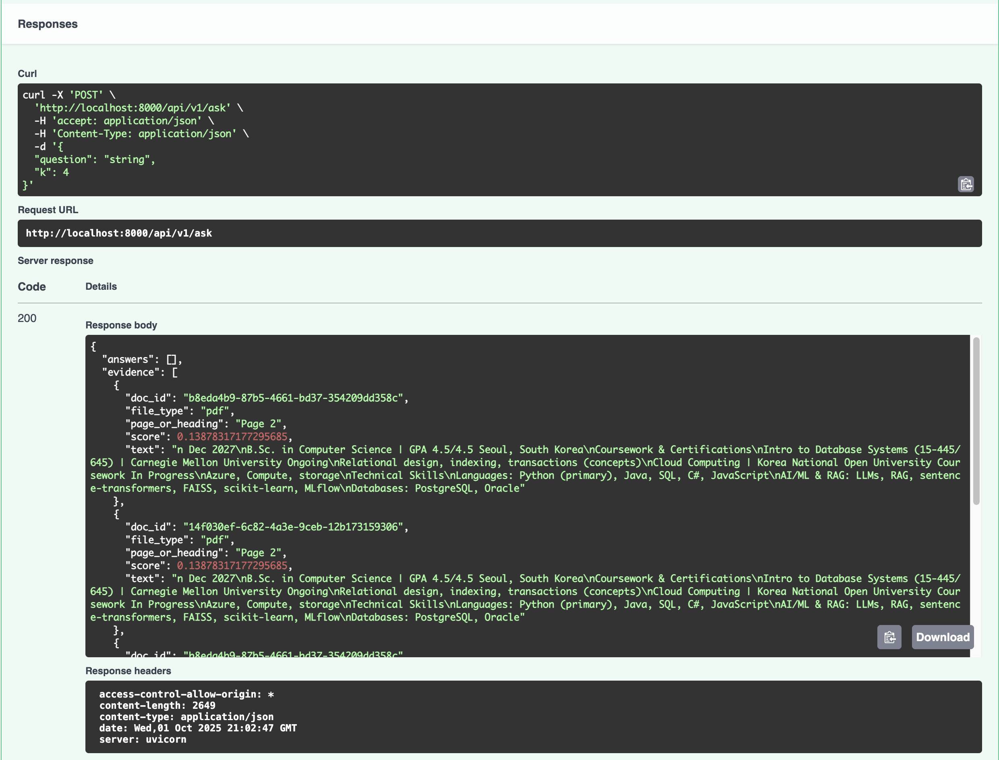

# Evidence DocSearch

**For Reviewers**
1. Run API: `uvicorn app:app --host 0.0.0.0 --port 8000`
2. Ingest a sample document (see "Sample Documents" below):
   - TXT: `curl -F "file=@tests/data/sample.txt" http://localhost:8000/api/v1/ingest`
   - DOCX: `curl -F "file=@tests/data/file-sample_1MB.docx" http://localhost:8000/api/v1/ingest`
   - PDF: `curl -F "file=@tests/data/resumeSample.pdf" http://localhost:8000/api/v1/ingest`
3. Ask: `curl -X POST -H "Content-Type: application/json" -d '{"question":"What does the system do?","k":3}' http://localhost:8000/api/v1/ask`



## Goal
Organize documents (ingest → chunk → embed) and deliver fast semantic search results that include citations (doc, page/heading, score) through a REST API.

## Highlights
- FastAPI service with `/api/v1/health`, `/api/v1/ingest`, and `/api/v1/ask` endpoints.
- TXT ingestion baseline with PDF (via pdfplumber) and DOCX (heading-aware using python-docx) extractors.
- all-MiniLM-L6-v2 sentence embeddings (cosine normalized) backed by FAISS; metadata stored in `data/meta.jsonl`.
- Evidence payload includes `doc_id`, `file_type`, `page_or_heading`, `offset`, `chunk_id`, and the matched text snippet.
- Safeguards: extension whitelist, file size (10 MB) and PDF page limit (50), sanitized error messages, and text-free logging.

## Sample Documents
- `tests/data/sample.txt` – Minimal walkthrough of the Evidence DocSearch flow (used by automated tests).
- `tests/data/file-sample_1MB.docx` – Longer DOCX file for validating heading-aware extraction and chunking.
- `tests/data/resumeSample.pdf` – Realistic multi-page PDF. Swap with your own resume or PDF to see page metadata in the evidence payload.

Use any of the files above with the `/api/v1/ingest` endpoint. After each ingest, call `/api/v1/ask` with a question that matches the document (for example, "What experience does Eddie have with RAG systems?" for the resume sample) to confirm evidence snippets reference the uploaded document and include the correct `page_or_heading`.

## Project Layout
```
.
├─ app.py                # FastAPI application
├─ services/             # Embeddings, chunking, ingest & search helpers
├─ data/                 # Persistent FAISS index + metadata jsonl
├─ tests/                # Pytest suite + sample data
├─ requirements.txt      # Runtime dependencies
└─ README.md             # This guide
```

## API
### `GET /api/v1/health`
Returns service status and current vector count.

### `POST /api/v1/ingest`
Multipart upload (`file`) that extracts text, chunks, embeds, and indexes the document.
Sample response:
```json
{
  "document_id": "...",
  "file_type": "txt",
  "num_chunks": 6,
  "embedding_model": "sentence-transformers/all-MiniLM-L6-v2"
}
```

### `POST /api/v1/ask`
JSON body: `{ "question": "…", "k": 4 }`. Returns ranked evidence snippets:
```json
{
  "answers": [],
  "evidence": [
    {
      "doc_id": "...",
      "file_type": "txt",
      "page_or_heading": "Paragraph 2",
      "score": 0.81,
      "text": "..."
    }
  ],
  "model_used": "sentence-transformers/all-MiniLM-L6-v2"
}
```

## Metadata Layout
Each line in `data/meta.jsonl`:
```json
{"id": 12, "doc_id": "...", "file_type": "txt", "chunk_id": 3, "page_or_heading": "Page 2", "offset": 1024, "text": "..."}
```

## Safeguards & Notes
- Allowed extensions: txt, pdf, docx. Files must be ≤10 MB; PDFs capped at 50 pages.
- Errors never leak filesystem paths or stack traces; logs omit document text.
- Environment overrides: set `EVIDENCE_DATA_DIR` to relocate storage and `EVIDENCE_USE_FAKE_EMBEDDINGS=1` to use a deterministic stub model (useful for tests).

## Setup
```bash
python3 -m venv .venv
source .venv/bin/activate
python3 -m pip install -r requirements.txt
uvicorn app:app --reload
```

## Testing
```bash
EVIDENCE_USE_FAKE_EMBEDDINGS=1 python3 -m pytest
```

## MVP Checklist
- [x] TXT ingest/ask flow operational
- [x] Evidence includes doc_id + page/heading + score
- [x] README For Reviewers + screenshot
- [x] Extension & size limits enforced
- [x] PDF/DOCX handlers implemented
- [ ] Optional: Dockerfile or MLflow logging (future)

## Changelog
